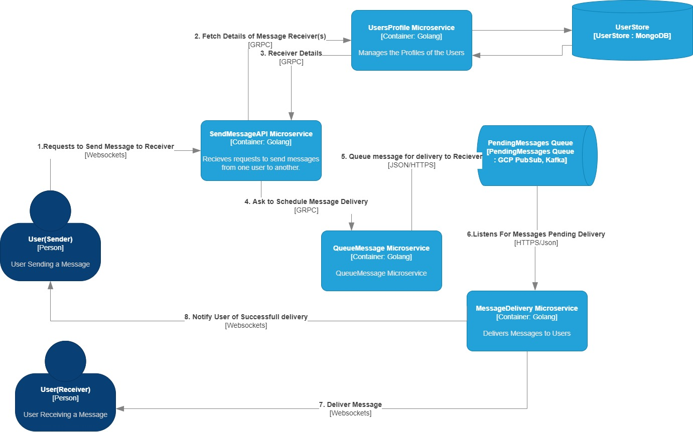

# IDT Messaging Api

This API functionality for creating and retrieving users from the IDT backend.

The Go-Kit library which provides industry standard building blocks for microservices was used extensively

## Routes Exposed
| Route                         | Method | Sample Request  | Sample Response                |
|-------------------------------|--------| ----------------| ---------------
| localhost:8080/v1/users            | PUT   | {"id": "test-user-2","name": "test-user-2","signUpTime": 6000} |{"id": "test-user-2","name": "test-user-2","signUpTime": 6000}
| localhost:8080/v1/users            | GET (List Users)   |  |{"users":[{"id": "test-user-2","name": "test-user-2","signUpTime": 6000}]}
| localhost:8080/v1/users/{users-id}           | GET (Get User)   |  |{"id": "test-user-2","name": "test-user-2","signUpTime": 6000}

## How to Run it Locally

You need to install docker first. Then you can run

```
docker build --tag idt-messaging-core-app .

docker run -p 127.0.0.1:8080:8080/tcp idt-messaging-core-app
```
## How to Run the Unit Tests
```
go test -v ./...
```

## One off Questions
### Describe on a high level how you would design a messaging backend.
#### Provide an architecture schematic



#### Discuss scalability and performance issues

Scalability
- Scalability will be handled by increasing the number of instances of the containers available
- The biggest challenge I see is handling of Idempotency when retrying message delivery. For those cases, I propose adding a unique key to each request right at the start when the user requests to send a message. Using the key, we can be able to dedup the retries and prevent double delivery of the same message
